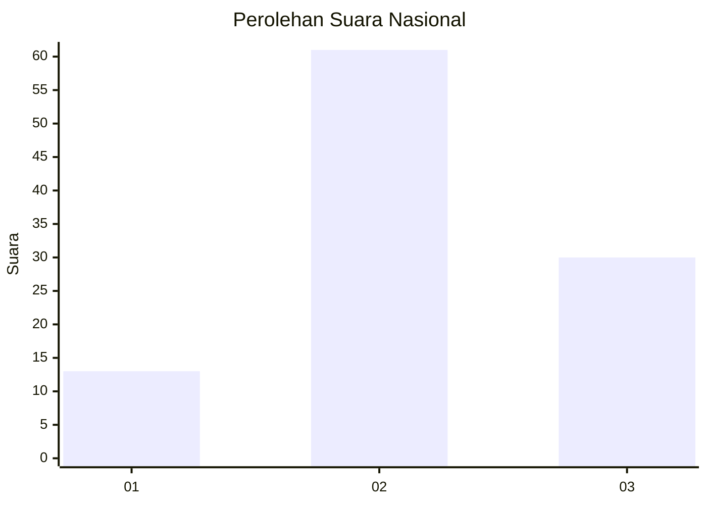
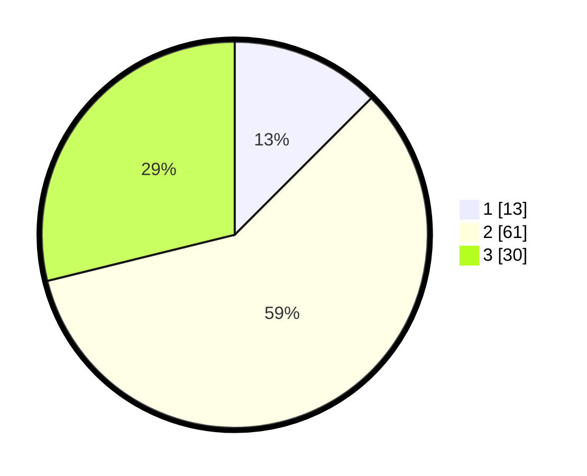

# Hasil

## Grafik

## Tabel

| No. | Nama Paslon    | Suara | Suara (raw) | Persentase |
|:--- |:-------------- | -----:| -----------:| ----------:|
| 1   | ANIES MUHAIMIN | 13    | [13][p-1]   | 12,50      |
| 2   | PRABOWO GIBRAN | 61    | [61][p-2]   | 58,65      |
| 3   | GANJAR MAHFUD  | 30    | [30][p-3]   | 28,85      |

[p-1]: https://github.com/gigit-pemilu/pemilu-2024/blob/main/pilpres/hitung-suara/sub/16-sumatera-selatan/sub/74-kota-prabumulih/sub/05-prabumulih-utara/sub/1001-pasar-prabumulih-i/sub/003-tps/sub/paslon-1.txt
[p-2]: https://github.com/gigit-pemilu/pemilu-2024/blob/main/pilpres/hitung-suara/sub/16-sumatera-selatan/sub/74-kota-prabumulih/sub/05-prabumulih-utara/sub/1001-pasar-prabumulih-i/sub/003-tps/sub/paslon-2.txt
[p-3]: https://github.com/gigit-pemilu/pemilu-2024/blob/main/pilpres/hitung-suara/sub/16-sumatera-selatan/sub/74-kota-prabumulih/sub/05-prabumulih-utara/sub/1001-pasar-prabumulih-i/sub/003-tps/sub/paslon-3.txt

## Foto C Plano

https://sirekap-obj-formc.kpu.go.id/f506/pemilu/ppwp/16/74/05/10/01/1674051001003-20240214-141028--d6975bfa-685e-4045-847f-015e4f50399a.jpg

https://sirekap-obj-formc.kpu.go.id/f506/pemilu/ppwp/16/74/05/10/01/1674051001003-20240214-232938--a49bea06-933a-4cf0-9fc9-0c77fa57d415.jpg

https://sirekap-obj-formc.kpu.go.id/f506/pemilu/ppwp/16/74/05/10/01/1674051001003-20240214-141909--d8a85bd9-c328-4e1e-be81-a34154ba431c.jpg

## Metadata

| Key        | Value               |
| ---------- | ------------------- |
| Time Stamp | 2024-02-16 06:30:27 |

## DATA PEMILIH TETAP

Jumlah pemilih dalam DPT: **132**.
 * L: **61**.
 * P: **71**.

## DATA PENGGUNA HAK PILIH

Jumlah pengguna hak pilih dalam DPT: **103**.
 * L: **51**.
 * P: **52**.

Jumlah pengguna hak pilih dalam DPTb: **0**.
 * L: **0**.
 * P: **0**.

Jumlah pengguna hak pilih dalam DPK: **2**.
 * L: **2**.
 * P: **0**.

Jumlah pengguna hak pilih: **105**.
 * L: **53**.
 * P: **52**.

## JUMLAH SUARA SAH DAN TIDAK SAH

JUMLAH SELURUH SUARA SAH: **104**.

JUMLAH SUARA TIDAK SAH: **1**.

JUMLAH SELURUH SUARA SAH DAN SUARA TIDAK SAH: **105**.

