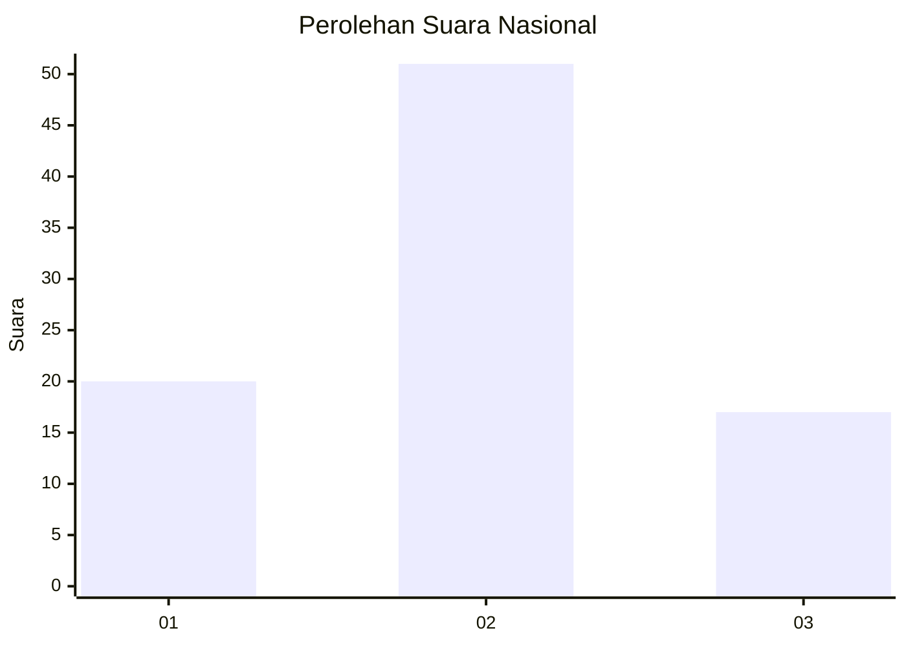
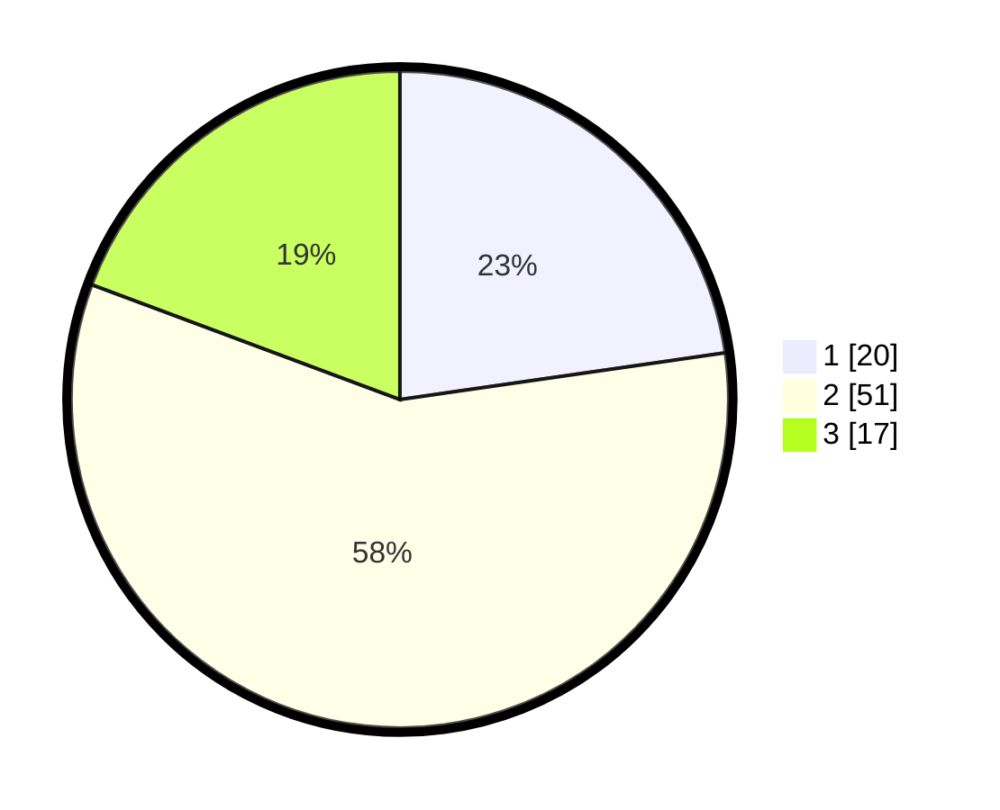

# Hasil

## Grafik

## Tabel

| No. | Nama Paslon    | Suara | Suara (raw) | Persentase |
|:--- |:-------------- | -----:| -----------:| ----------:|
| 1   | ANIES MUHAIMIN | 20    | [20][p-1]   | 22,73      |
| 2   | PRABOWO GIBRAN | 51    | [51][p-2]   | 57,95      |
| 3   | GANJAR MAHFUD  | 17    | [17][p-3]   | 19,32      |

[p-1]: https://github.com/gigit-pemilu/pemilu-2024/blob/main/pilpres/hitung-suara/sub/16-sumatera-selatan/sub/74-kota-prabumulih/sub/05-prabumulih-utara/sub/1001-pasar-prabumulih-i/sub/004-tps/sub/paslon-1.txt
[p-2]: https://github.com/gigit-pemilu/pemilu-2024/blob/main/pilpres/hitung-suara/sub/16-sumatera-selatan/sub/74-kota-prabumulih/sub/05-prabumulih-utara/sub/1001-pasar-prabumulih-i/sub/004-tps/sub/paslon-2.txt
[p-3]: https://github.com/gigit-pemilu/pemilu-2024/blob/main/pilpres/hitung-suara/sub/16-sumatera-selatan/sub/74-kota-prabumulih/sub/05-prabumulih-utara/sub/1001-pasar-prabumulih-i/sub/004-tps/sub/paslon-3.txt

## Foto C Plano

https://sirekap-obj-formc.kpu.go.id/dfb4/pemilu/ppwp/16/74/05/10/01/1674051001004-20240217-095935--8924fafe-5378-4866-8bff-b48216376f04.jpg

https://sirekap-obj-formc.kpu.go.id/dfb4/pemilu/ppwp/16/74/05/10/01/1674051001004-20240217-095936--69827458-f199-453f-be85-8bc7d4aaec99.jpg

https://sirekap-obj-formc.kpu.go.id/dfb4/pemilu/ppwp/16/74/05/10/01/1674051001004-20240217-095935--b1c40fbe-7d04-4330-8b16-b0e488ac43ae.jpg

## Metadata

| Key        | Value               |
| ---------- | ------------------- |
| Time Stamp | 2024-02-22 08:00:00 |

## DATA PEMILIH TETAP

Jumlah pemilih dalam DPT: **0**.
 * L: **0**.
 * P: **0**.

## DATA PENGGUNA HAK PILIH

Jumlah pengguna hak pilih dalam DPT: **0**.
 * L: **0**.
 * P: **0**.

Jumlah pengguna hak pilih dalam DPTb: **0**.
 * L: **0**.
 * P: **0**.

Jumlah pengguna hak pilih dalam DPK: **0**.
 * L: **0**.
 * P: **0**.

Jumlah pengguna hak pilih: **0**.
 * L: **0**.
 * P: **0**.

## JUMLAH SUARA SAH DAN TIDAK SAH

JUMLAH SELURUH SUARA SAH: **88**.

JUMLAH SUARA TIDAK SAH: **2**.

JUMLAH SELURUH SUARA SAH DAN SUARA TIDAK SAH: **90**.

