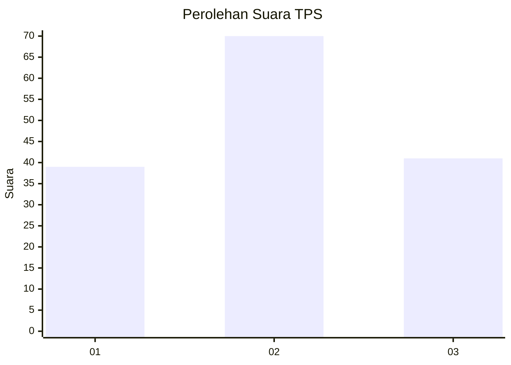
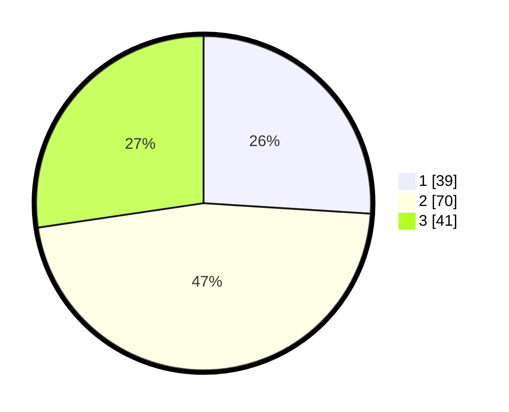

# Hasil

## Grafik

## Tabel

| No. | Nama Paslon    | Suara | Suara (raw) | Persentase |
|:--- |:-------------- | -----:| -----------:| ----------:|
| 1   | ANIES MUHAIMIN | 39    | [39][p-1]   | 26,00      |
| 2   | PRABOWO GIBRAN | 70    | [70][p-2]   | 46,67      |
| 3   | GANJAR MAHFUD  | 41    | [41][p-3]   | 27,33      |

[p-1]: https://github.com/gigit-pemilu/pemilu-2024-16-sumatera-selatan/blob/main/pilpres/hitung-suara/sub/16-sumatera-selatan/sub/74-kota-prabumulih/sub/05-prabumulih-utara/sub/1001-pasar-prabumulih-i/sub/007-tps/sub/paslon-1.txt
[p-2]: https://github.com/gigit-pemilu/pemilu-2024-16-sumatera-selatan/blob/main/pilpres/hitung-suara/sub/16-sumatera-selatan/sub/74-kota-prabumulih/sub/05-prabumulih-utara/sub/1001-pasar-prabumulih-i/sub/007-tps/sub/paslon-2.txt
[p-3]: https://github.com/gigit-pemilu/pemilu-2024-16-sumatera-selatan/blob/main/pilpres/hitung-suara/sub/16-sumatera-selatan/sub/74-kota-prabumulih/sub/05-prabumulih-utara/sub/1001-pasar-prabumulih-i/sub/007-tps/sub/paslon-3.txt

## Foto C Plano

https://sirekap-obj-formc.kpu.go.id/b4c2/pemilu/ppwp/16/74/05/10/01/1674051001007-20240214-205413--a66584d1-d852-487a-b11c-3784675d0400.jpg

https://sirekap-obj-formc.kpu.go.id/b4c2/pemilu/ppwp/16/74/05/10/01/1674051001007-20240214-221356--bec9dc64-755a-49d2-9338-7fa5082e4e59.jpg

https://sirekap-obj-formc.kpu.go.id/b4c2/pemilu/ppwp/16/74/05/10/01/1674051001007-20240214-221646--9db2b075-df77-4678-91c9-e8aa400d2bb8.jpg

## Metadata

| Key        | Value               |
| ---------- | ------------------- |
| Time Stamp | 2024-02-16 12:51:22 |

## DATA PEMILIH TETAP

Jumlah pemilih dalam DPT: **178**.
 * L: **86**.
 * P: **92**.

## DATA PENGGUNA HAK PILIH

Jumlah pengguna hak pilih dalam DPT: **149**.
 * L: **72**.
 * P: **77**.

Jumlah pengguna hak pilih dalam DPTb: **0**.
 * L: **0**.
 * P: **0**.

Jumlah pengguna hak pilih dalam DPK: **3**.
 * L: **3**.
 * P: **0**.

Jumlah pengguna hak pilih: **152**.
 * L: **75**.
 * P: **77**.

## JUMLAH SUARA SAH DAN TIDAK SAH

JUMLAH SELURUH SUARA SAH: **150**.

JUMLAH SUARA TIDAK SAH: **2**.

JUMLAH SELURUH SUARA SAH DAN SUARA TIDAK SAH: **152**.

