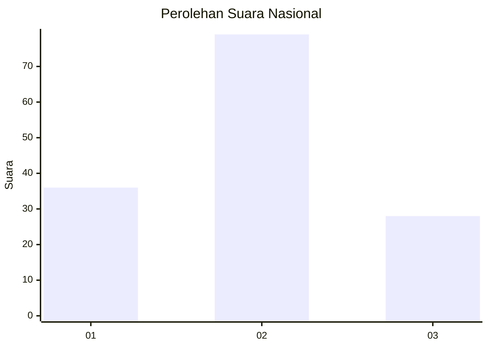
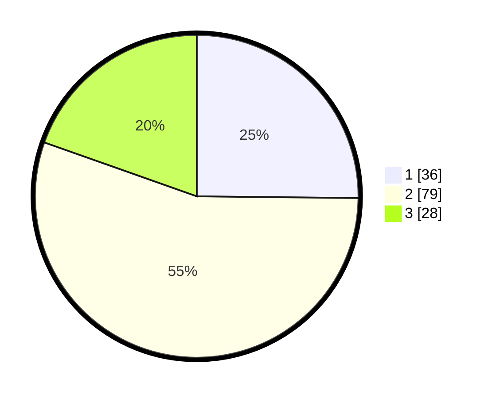

# Hasil

## Grafik

## Tabel

| No. | Nama Paslon    | Suara | Suara (raw) | Persentase |
|:--- |:-------------- | -----:| -----------:| ----------:|
| 1   | ANIES MUHAIMIN | 36    | [36][p-1]   | 25,17      |
| 2   | PRABOWO GIBRAN | 79    | [79][p-2]   | 55,24      |
| 3   | GANJAR MAHFUD  | 28    | [28][p-3]   | 19,58      |

[p-1]: https://github.com/gigit-pemilu/pemilu-2024/blob/main/pilpres/hitung-suara/sub/16-sumatera-selatan/sub/74-kota-prabumulih/sub/05-prabumulih-utara/sub/1001-pasar-prabumulih-i/sub/008-tps/sub/paslon-1.txt
[p-2]: https://github.com/gigit-pemilu/pemilu-2024/blob/main/pilpres/hitung-suara/sub/16-sumatera-selatan/sub/74-kota-prabumulih/sub/05-prabumulih-utara/sub/1001-pasar-prabumulih-i/sub/008-tps/sub/paslon-2.txt
[p-3]: https://github.com/gigit-pemilu/pemilu-2024/blob/main/pilpres/hitung-suara/sub/16-sumatera-selatan/sub/74-kota-prabumulih/sub/05-prabumulih-utara/sub/1001-pasar-prabumulih-i/sub/008-tps/sub/paslon-3.txt

## Foto C Plano

https://sirekap-obj-formc.kpu.go.id/5c23/pemilu/ppwp/16/74/05/10/01/1674051001008-20240214-190938--8fd3b5a7-4fe7-407b-961c-a42cc5c8dfdf.jpg

https://sirekap-obj-formc.kpu.go.id/5c23/pemilu/ppwp/16/74/05/10/01/1674051001008-20240215-030508--ca931b6d-d158-41ee-a76e-9366c5dc6bb9.jpg

https://sirekap-obj-formc.kpu.go.id/5c23/pemilu/ppwp/16/74/05/10/01/1674051001008-20240214-215850--1b6cc14f-167f-4376-afea-c73c5b7e3c2e.jpg

## Metadata

| Key        | Value               |
| ---------- | ------------------- |
| Time Stamp | 2024-02-16 06:30:27 |

## DATA PEMILIH TETAP

Jumlah pemilih dalam DPT: **183**.
 * L: **93**.
 * P: **90**.

## DATA PENGGUNA HAK PILIH

Jumlah pengguna hak pilih dalam DPT: **145**.
 * L: **73**.
 * P: **72**.

Jumlah pengguna hak pilih dalam DPTb: **0**.
 * L: **0**.
 * P: **0**.

Jumlah pengguna hak pilih dalam DPK: **0**.
 * L: **0**.
 * P: **0**.

Jumlah pengguna hak pilih: **145**.
 * L: **73**.
 * P: **72**.

## JUMLAH SUARA SAH DAN TIDAK SAH

JUMLAH SELURUH SUARA SAH: **143**.

JUMLAH SUARA TIDAK SAH: **2**.

JUMLAH SELURUH SUARA SAH DAN SUARA TIDAK SAH: **145**.

