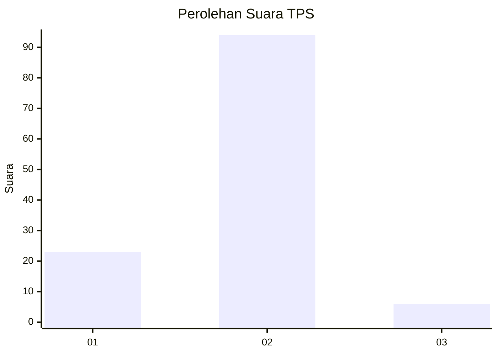
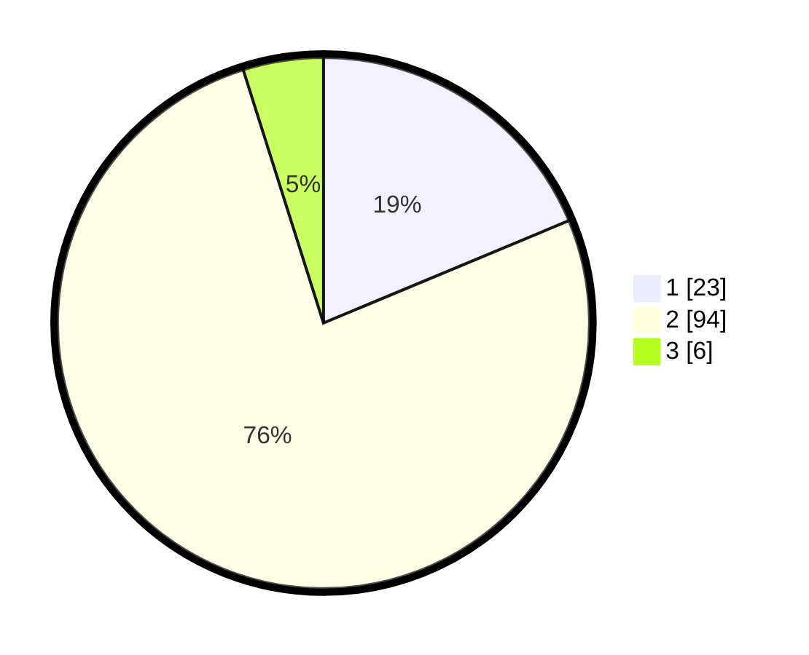

# Hasil

## Grafik

## Tabel

| No. | Nama Paslon    | Suara | Suara (raw) | Persentase |
|:--- |:-------------- | -----:| -----------:| ----------:|
| 1   | ANIES MUHAIMIN | 23    | [23][p-1]   | 18,70      |
| 2   | PRABOWO GIBRAN | 94    | [94][p-2]   | 76,42      |
| 3   | GANJAR MAHFUD  | 6     | [6][p-3]    | 4,88       |

[p-1]: https://github.com/gigit-pemilu/pemilu-2024-16-sumatera-selatan/blob/main/pilpres/hitung-suara/sub/16-sumatera-selatan/sub/74-kota-prabumulih/sub/05-prabumulih-utara/sub/1002-pasar-prabumulih-ii/sub/001-tps/sub/paslon-1.txt
[p-2]: https://github.com/gigit-pemilu/pemilu-2024-16-sumatera-selatan/blob/main/pilpres/hitung-suara/sub/16-sumatera-selatan/sub/74-kota-prabumulih/sub/05-prabumulih-utara/sub/1002-pasar-prabumulih-ii/sub/001-tps/sub/paslon-2.txt
[p-3]: https://github.com/gigit-pemilu/pemilu-2024-16-sumatera-selatan/blob/main/pilpres/hitung-suara/sub/16-sumatera-selatan/sub/74-kota-prabumulih/sub/05-prabumulih-utara/sub/1002-pasar-prabumulih-ii/sub/001-tps/sub/paslon-3.txt

## Foto C Plano

https://sirekap-obj-formc.kpu.go.id/b76e/pemilu/ppwp/16/74/05/10/02/1674051002001-20240214-215943--2e5332bf-e699-4c27-82e8-470d4de7953e.jpg

https://sirekap-obj-formc.kpu.go.id/b76e/pemilu/ppwp/16/74/05/10/02/1674051002001-20240214-220301--6d805177-1d09-4b3f-b0ca-8fc361b98ce6.jpg

https://sirekap-obj-formc.kpu.go.id/b76e/pemilu/ppwp/16/74/05/10/02/1674051002001-20240214-220401--23f871d1-1cb1-4093-b77a-cfc25d492c8b.jpg

## Metadata

| Key        | Value               |
| ---------- | ------------------- |
| Time Stamp | 2024-02-15 23:29:50 |

