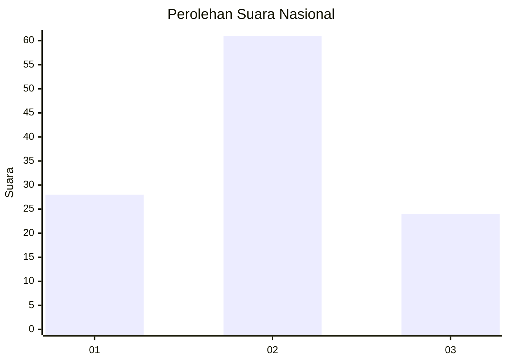
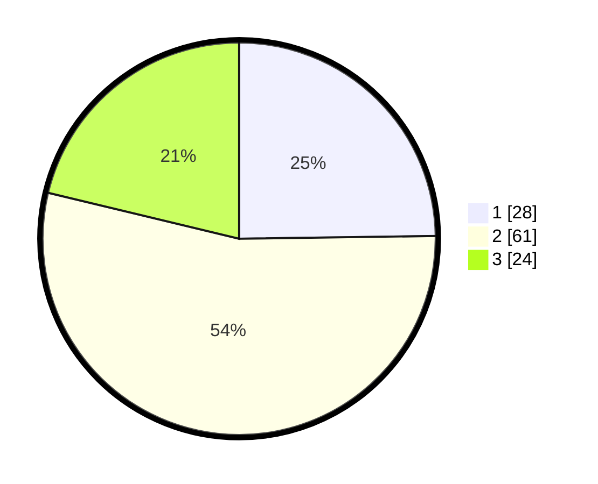

# Hasil

## Grafik

## Tabel

| No. | Nama Paslon    | Suara | Suara (raw) | Persentase |
|:--- |:-------------- | -----:| -----------:| ----------:|
| 1   | ANIES MUHAIMIN | 28    | [28][p-1]   | 24,78      |
| 2   | PRABOWO GIBRAN | 61    | [61][p-2]   | 53,98      |
| 3   | GANJAR MAHFUD  | 24    | [24][p-3]   | 21,24      |

[p-1]: https://github.com/gigit-pemilu/pemilu-2024/blob/main/pilpres/hitung-suara/sub/16-sumatera-selatan/sub/74-kota-prabumulih/sub/05-prabumulih-utara/sub/1002-pasar-prabumulih-ii/sub/002-tps/sub/paslon-1.txt
[p-2]: https://github.com/gigit-pemilu/pemilu-2024/blob/main/pilpres/hitung-suara/sub/16-sumatera-selatan/sub/74-kota-prabumulih/sub/05-prabumulih-utara/sub/1002-pasar-prabumulih-ii/sub/002-tps/sub/paslon-2.txt
[p-3]: https://github.com/gigit-pemilu/pemilu-2024/blob/main/pilpres/hitung-suara/sub/16-sumatera-selatan/sub/74-kota-prabumulih/sub/05-prabumulih-utara/sub/1002-pasar-prabumulih-ii/sub/002-tps/sub/paslon-3.txt

## Foto C Plano

https://sirekap-obj-formc.kpu.go.id/62a0/pemilu/ppwp/16/74/05/10/02/1674051002002-20240214-141430--99bc5c76-7803-48ec-ac57-69d2d7eb2dc0.jpg

https://sirekap-obj-formc.kpu.go.id/62a0/pemilu/ppwp/16/74/05/10/02/1674051002002-20240214-141512--f47b350b-27ad-41e9-a0cd-a40c9840fc66.jpg

## Metadata

| Key        | Value               |
| ---------- | ------------------- |
| Time Stamp | 2024-02-15 07:00:44 |

