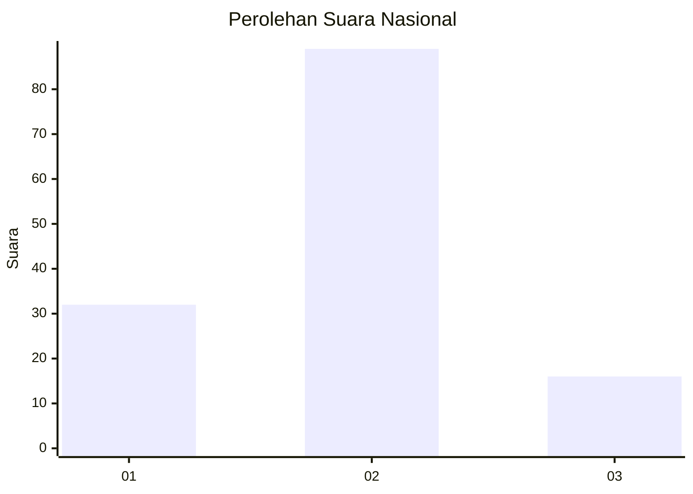
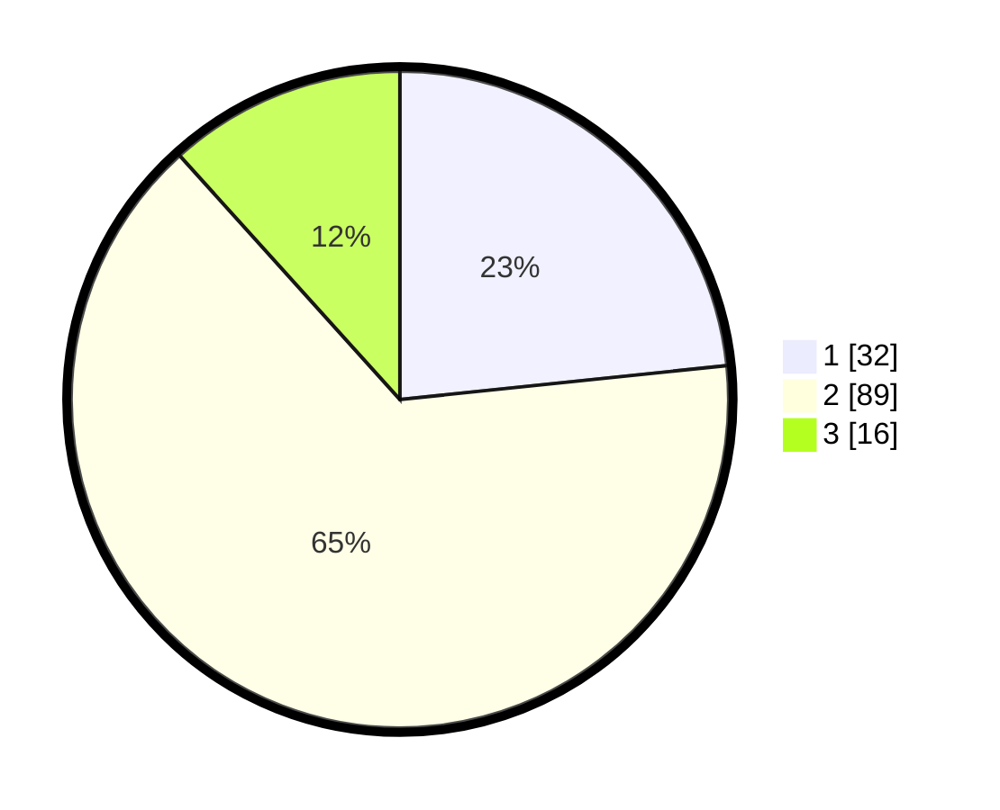

# Hasil

## Grafik

## Tabel

| No. | Nama Paslon    | Suara | Suara (raw) | Persentase |
|:--- |:-------------- | -----:| -----------:| ----------:|
| 1   | ANIES MUHAIMIN | 32    | [32][p-1]   | 23,36      |
| 2   | PRABOWO GIBRAN | 89    | [89][p-2]   | 64,96      |
| 3   | GANJAR MAHFUD  | 16    | [16][p-3]   | 11,68      |

[p-1]: https://github.com/gigit-pemilu/pemilu-2024/blob/main/pilpres/hitung-suara/sub/16-sumatera-selatan/sub/74-kota-prabumulih/sub/05-prabumulih-utara/sub/1002-pasar-prabumulih-ii/sub/010-tps/sub/paslon-1.txt
[p-2]: https://github.com/gigit-pemilu/pemilu-2024/blob/main/pilpres/hitung-suara/sub/16-sumatera-selatan/sub/74-kota-prabumulih/sub/05-prabumulih-utara/sub/1002-pasar-prabumulih-ii/sub/010-tps/sub/paslon-2.txt
[p-3]: https://github.com/gigit-pemilu/pemilu-2024/blob/main/pilpres/hitung-suara/sub/16-sumatera-selatan/sub/74-kota-prabumulih/sub/05-prabumulih-utara/sub/1002-pasar-prabumulih-ii/sub/010-tps/sub/paslon-3.txt

## Foto C Plano

https://sirekap-obj-formc.kpu.go.id/e1aa/pemilu/ppwp/16/74/05/10/02/1674051002010-20240215-023514--5406a3a8-1dc6-4c21-89d8-990b0b2570b2.jpg

https://sirekap-obj-formc.kpu.go.id/e1aa/pemilu/ppwp/16/74/05/10/02/1674051002010-20240215-023706--e82f5418-66f2-4510-9d62-3f0fd71b044e.jpg

https://sirekap-obj-formc.kpu.go.id/e1aa/pemilu/ppwp/16/74/05/10/02/1674051002010-20240214-211157--e0a9a4ca-98b2-4fc7-a85f-6a4239ba3e57.jpg

## Metadata

| Key        | Value               |
| ---------- | ------------------- |
| Time Stamp | 2024-02-16 08:00:28 |

