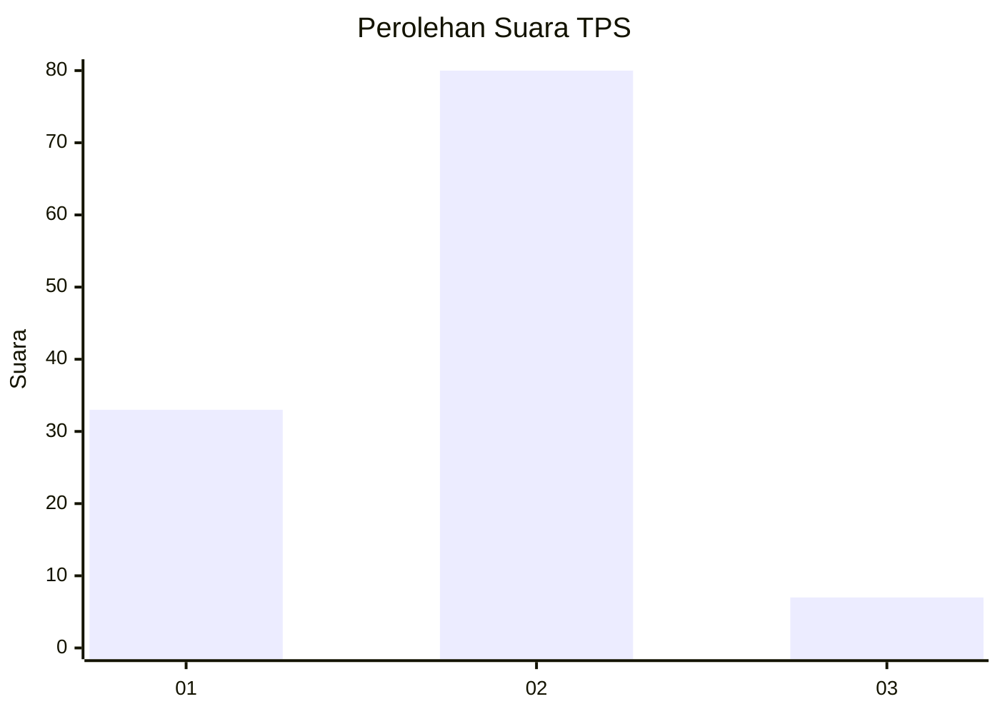
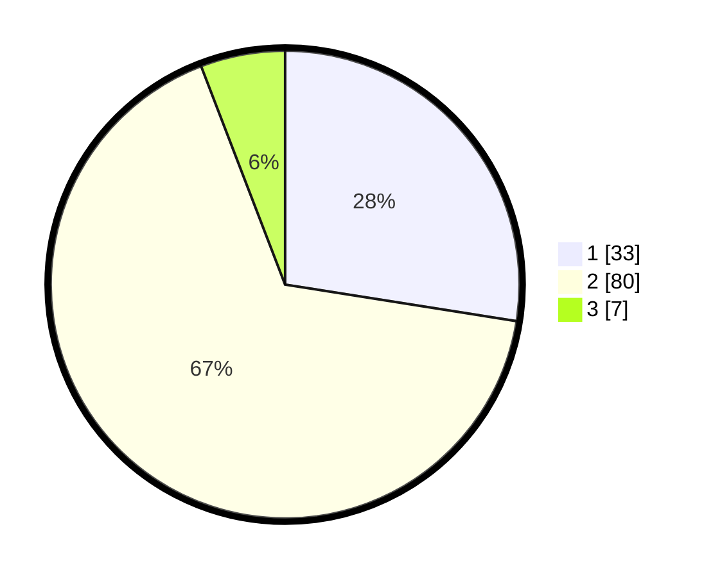

# Hasil

## Grafik

## Tabel

| No. | Nama Paslon    | Suara | Suara (raw) | Persentase |
|:--- |:-------------- | -----:| -----------:| ----------:|
| 1   | ANIES MUHAIMIN | 33    | [33][p-1]   | 27,50      |
| 2   | PRABOWO GIBRAN | 80    | [80][p-2]   | 66,67      |
| 3   | GANJAR MAHFUD  | 7     | [7][p-3]    | 5,83       |

[p-1]: https://github.com/gigit-pemilu/pemilu-2024-16-sumatera-selatan/blob/main/pilpres/hitung-suara/sub/16-sumatera-selatan/sub/74-kota-prabumulih/sub/05-prabumulih-utara/sub/1002-pasar-prabumulih-ii/sub/023-tps/sub/paslon-1.txt
[p-2]: https://github.com/gigit-pemilu/pemilu-2024-16-sumatera-selatan/blob/main/pilpres/hitung-suara/sub/16-sumatera-selatan/sub/74-kota-prabumulih/sub/05-prabumulih-utara/sub/1002-pasar-prabumulih-ii/sub/023-tps/sub/paslon-2.txt
[p-3]: https://github.com/gigit-pemilu/pemilu-2024-16-sumatera-selatan/blob/main/pilpres/hitung-suara/sub/16-sumatera-selatan/sub/74-kota-prabumulih/sub/05-prabumulih-utara/sub/1002-pasar-prabumulih-ii/sub/023-tps/sub/paslon-3.txt

## Foto C Plano

https://sirekap-obj-formc.kpu.go.id/f338/pemilu/ppwp/16/74/05/10/02/1674051002023-20240215-005543--b40e598d-2c2d-4d63-843c-22995f0c5a60.jpg

https://sirekap-obj-formc.kpu.go.id/f338/pemilu/ppwp/16/74/05/10/02/1674051002023-20240215-005759--adaba356-a738-4bf4-a4d1-bc328515a42b.jpg

https://sirekap-obj-formc.kpu.go.id/f338/pemilu/ppwp/16/74/05/10/02/1674051002023-20240215-005915--9a0234b1-61f5-4fc8-8e23-d4687698bce0.jpg

## Metadata

| Key        | Value               |
| ---------- | ------------------- |
| Time Stamp | 2024-02-16 08:00:28 |

