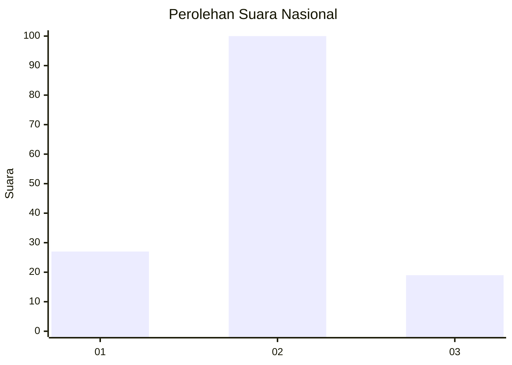
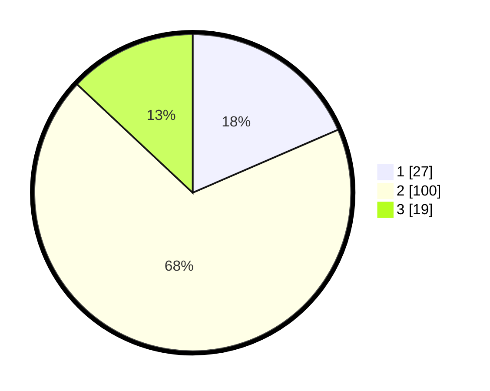

# Hasil

## Grafik

## Tabel

| No. | Nama Paslon    | Suara | Suara (raw) | Persentase |
|:--- |:-------------- | -----:| -----------:| ----------:|
| 1   | ANIES MUHAIMIN | 27    | [27][p-1]   | 18,49      |
| 2   | PRABOWO GIBRAN | 100   | [100][p-2]  | 68,49      |
| 3   | GANJAR MAHFUD  | 19    | [19][p-3]   | 13,01      |

[p-1]: https://github.com/gigit-pemilu/pemilu-2024/blob/main/pilpres/hitung-suara/sub/16-sumatera-selatan/sub/74-kota-prabumulih/sub/05-prabumulih-utara/sub/1003-wonosari/sub/035-tps/sub/paslon-1.txt
[p-2]: https://github.com/gigit-pemilu/pemilu-2024/blob/main/pilpres/hitung-suara/sub/16-sumatera-selatan/sub/74-kota-prabumulih/sub/05-prabumulih-utara/sub/1003-wonosari/sub/035-tps/sub/paslon-2.txt
[p-3]: https://github.com/gigit-pemilu/pemilu-2024/blob/main/pilpres/hitung-suara/sub/16-sumatera-selatan/sub/74-kota-prabumulih/sub/05-prabumulih-utara/sub/1003-wonosari/sub/035-tps/sub/paslon-3.txt

## Foto C Plano

https://sirekap-obj-formc.kpu.go.id/9a53/pemilu/ppwp/16/74/05/10/03/1674051003035-20240216-112622--556cbade-0e77-430c-b970-231599df2b6b.jpg

https://sirekap-obj-formc.kpu.go.id/9a53/pemilu/ppwp/16/74/05/10/03/1674051003035-20240214-200714--a4706474-c121-402f-b1c8-328ee4c31884.jpg

https://sirekap-obj-formc.kpu.go.id/9a53/pemilu/ppwp/16/74/05/10/03/1674051003035-20240216-112822--c8a75b88-5932-45c1-9252-8fdd37b587d6.jpg

## Metadata

| Key        | Value               |
| ---------- | ------------------- |
| Time Stamp | 2024-02-16 12:51:22 |

