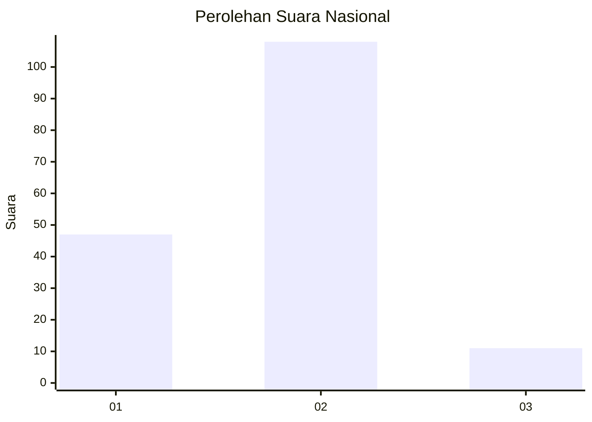
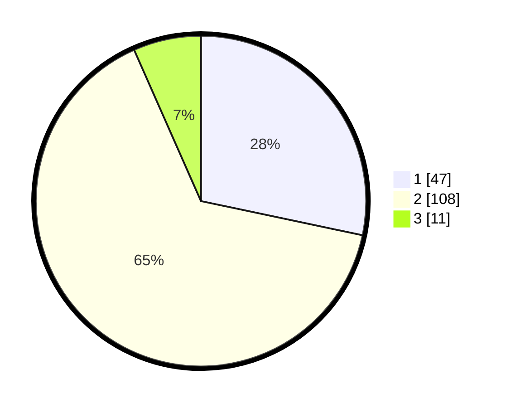

# Hasil

## Grafik

## Tabel

| No. | Nama Paslon    | Suara | Suara (raw) | Persentase |
|:--- |:-------------- | -----:| -----------:| ----------:|
| 1   | ANIES MUHAIMIN | 47    | [47][p-1]   | 28,31      |
| 2   | PRABOWO GIBRAN | 108   | [108][p-2]  | 65,06      |
| 3   | GANJAR MAHFUD  | 11    | [11][p-3]   | 6,63       |

[p-1]: https://github.com/gigit-pemilu/pemilu-2024/blob/main/pilpres/hitung-suara/sub/16-sumatera-selatan/sub/74-kota-prabumulih/sub/05-prabumulih-utara/sub/1004-mangga-besar/sub/009-tps/sub/paslon-1.txt
[p-2]: https://github.com/gigit-pemilu/pemilu-2024/blob/main/pilpres/hitung-suara/sub/16-sumatera-selatan/sub/74-kota-prabumulih/sub/05-prabumulih-utara/sub/1004-mangga-besar/sub/009-tps/sub/paslon-2.txt
[p-3]: https://github.com/gigit-pemilu/pemilu-2024/blob/main/pilpres/hitung-suara/sub/16-sumatera-selatan/sub/74-kota-prabumulih/sub/05-prabumulih-utara/sub/1004-mangga-besar/sub/009-tps/sub/paslon-3.txt

## Foto C Plano

https://sirekap-obj-formc.kpu.go.id/ab9d/pemilu/ppwp/16/74/05/10/04/1674051004009-20240217-092254--20a4b403-aea9-4e58-b2fe-570a77737066.jpg

https://sirekap-obj-formc.kpu.go.id/ab9d/pemilu/ppwp/16/74/05/10/04/1674051004009-20240215-022833--fe2d5e2e-3e3d-42f6-b30d-7ae4bb19e0cf.jpg

https://sirekap-obj-formc.kpu.go.id/ab9d/pemilu/ppwp/16/74/05/10/04/1674051004009-20240215-022929--7bd8ad91-57dc-477f-8189-cd31e9a100c0.jpg

## Metadata

| Key        | Value               |
| ---------- | ------------------- |
| Time Stamp | 2024-02-17 09:30:03 |

