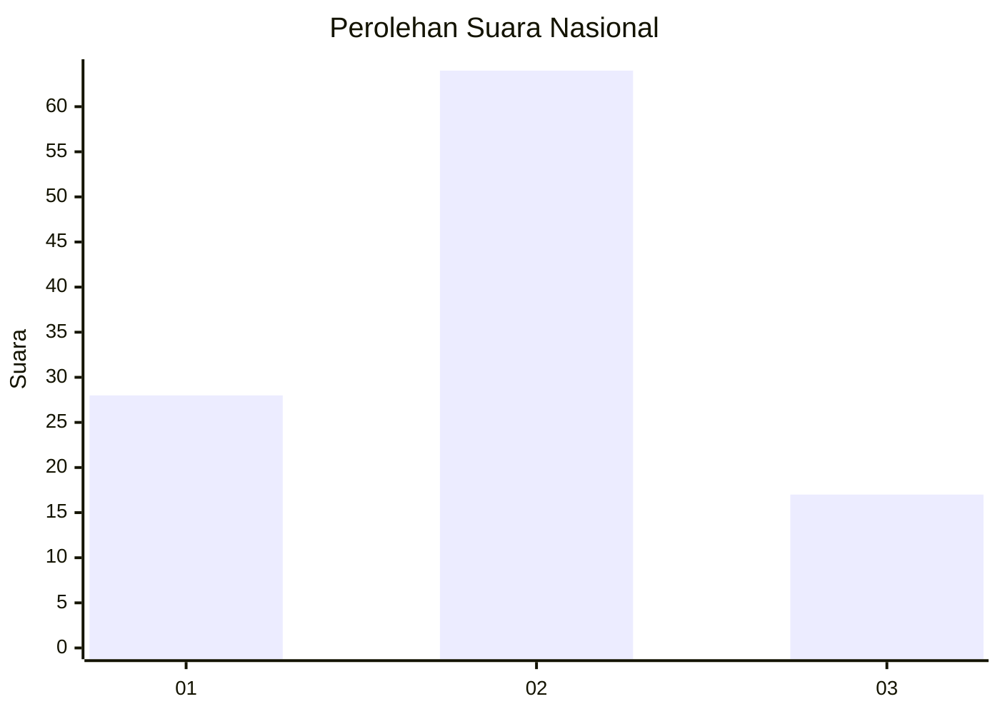
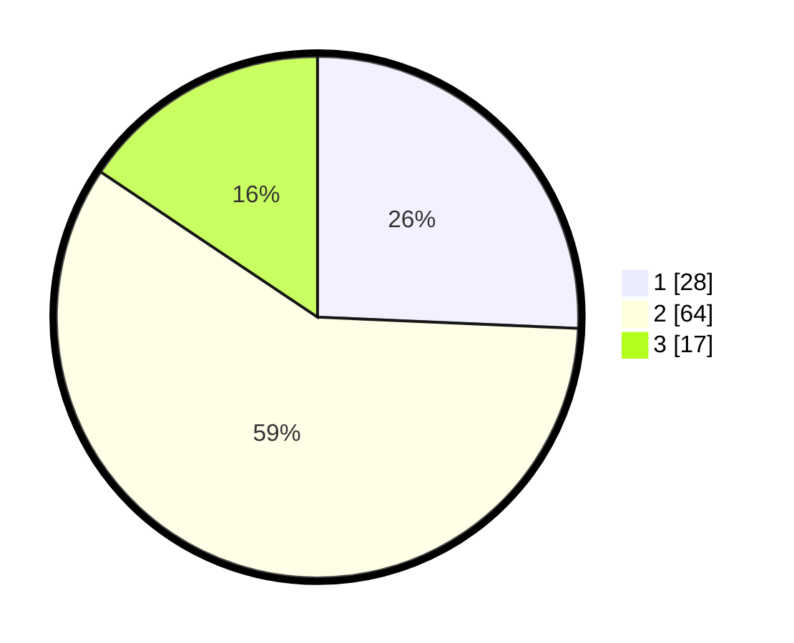

# Hasil

## Grafik

## Tabel

| No. | Nama Paslon    | Suara | Suara (raw) | Persentase |
|:--- |:-------------- | -----:| -----------:| ----------:|
| 1   | ANIES MUHAIMIN | 28    | [28][p-1]   | 25,69      |
| 2   | PRABOWO GIBRAN | 64    | [64][p-2]   | 58,72      |
| 3   | GANJAR MAHFUD  | 17    | [17][p-3]   | 15,60      |

[p-1]: https://github.com/gigit-pemilu/pemilu-2024/blob/main/pilpres/hitung-suara/sub/16-sumatera-selatan/sub/74-kota-prabumulih/sub/05-prabumulih-utara/sub/1004-mangga-besar/sub/016-tps/sub/paslon-1.txt
[p-2]: https://github.com/gigit-pemilu/pemilu-2024/blob/main/pilpres/hitung-suara/sub/16-sumatera-selatan/sub/74-kota-prabumulih/sub/05-prabumulih-utara/sub/1004-mangga-besar/sub/016-tps/sub/paslon-2.txt
[p-3]: https://github.com/gigit-pemilu/pemilu-2024/blob/main/pilpres/hitung-suara/sub/16-sumatera-selatan/sub/74-kota-prabumulih/sub/05-prabumulih-utara/sub/1004-mangga-besar/sub/016-tps/sub/paslon-3.txt

## Foto C Plano

https://sirekap-obj-formc.kpu.go.id/9781/pemilu/ppwp/16/74/05/10/04/1674051004016-20240215-032716--809d30f4-74a4-40c2-88a2-cdefba6df03c.jpg

https://sirekap-obj-formc.kpu.go.id/9781/pemilu/ppwp/16/74/05/10/04/1674051004016-20240215-042725--7bef8151-cc9a-4c6b-94e9-ddb15f249404.jpg

https://sirekap-obj-formc.kpu.go.id/9781/pemilu/ppwp/16/74/05/10/04/1674051004016-20240215-042809--2686a876-94ae-41c4-92f3-165c63a71136.jpg

## Metadata

| Key        | Value               |
| ---------- | ------------------- |
| Time Stamp | 2024-02-16 08:00:28 |

