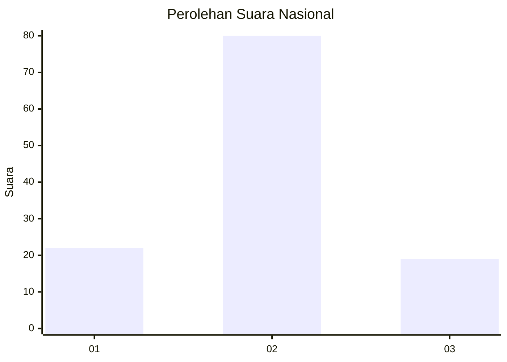
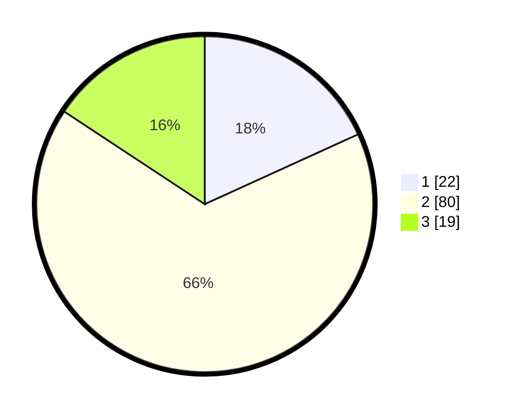

# Hasil

## Grafik

## Tabel

| No. | Nama Paslon    | Suara | Suara (raw) | Persentase |
|:--- |:-------------- | -----:| -----------:| ----------:|
| 1   | ANIES MUHAIMIN | 22    | [22][p-1]   | 18,18      |
| 2   | PRABOWO GIBRAN | 80    | [80][p-2]   | 66,12      |
| 3   | GANJAR MAHFUD  | 19    | [19][p-3]   | 15,70      |

[p-1]: https://github.com/gigit-pemilu/pemilu-2024/blob/main/pilpres/hitung-suara/sub/16-sumatera-selatan/sub/74-kota-prabumulih/sub/05-prabumulih-utara/sub/1004-mangga-besar/sub/017-tps/sub/paslon-1.txt
[p-2]: https://github.com/gigit-pemilu/pemilu-2024/blob/main/pilpres/hitung-suara/sub/16-sumatera-selatan/sub/74-kota-prabumulih/sub/05-prabumulih-utara/sub/1004-mangga-besar/sub/017-tps/sub/paslon-2.txt
[p-3]: https://github.com/gigit-pemilu/pemilu-2024/blob/main/pilpres/hitung-suara/sub/16-sumatera-selatan/sub/74-kota-prabumulih/sub/05-prabumulih-utara/sub/1004-mangga-besar/sub/017-tps/sub/paslon-3.txt

## Foto C Plano

https://sirekap-obj-formc.kpu.go.id/f7b5/pemilu/ppwp/16/74/05/10/04/1674051004017-20240214-141707--d5e506c4-d18d-44ce-97c8-fc76da380183.jpg

https://sirekap-obj-formc.kpu.go.id/f7b5/pemilu/ppwp/16/74/05/10/04/1674051004017-20240214-141746--f2ffed1c-169c-44e2-a085-63aa8dada369.jpg

https://sirekap-obj-formc.kpu.go.id/f7b5/pemilu/ppwp/16/74/05/10/04/1674051004017-20240215-011014--a59476a8-c019-41b9-a274-20b37420d05d.jpg

## Metadata

| Key        | Value               |
| ---------- | ------------------- |
| Time Stamp | 2024-02-15 15:00:29 |

