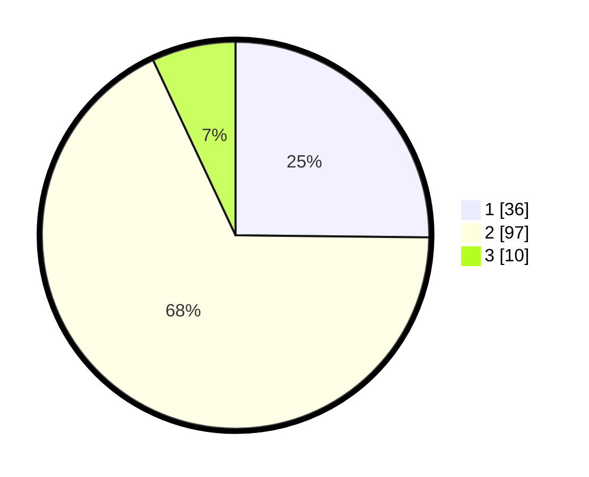

# Hasil

## Grafik

## Tabel

| No. | Nama Paslon    | Suara | Suara (raw) | Persentase |
|:--- |:-------------- | -----:| -----------:| ----------:|
| 1   | ANIES MUHAIMIN | 36    | [36][p-1]   | 25,17      |
| 2   | PRABOWO GIBRAN | 97    | [97][p-2]   | 67,83      |
| 3   | GANJAR MAHFUD  | 10    | [10][p-3]   | 6,99       |

[p-1]: https://github.com/gigit-pemilu/pemilu-2024-16-sumatera-selatan/blob/main/pilpres/hitung-suara/sub/16-sumatera-selatan/sub/74-kota-prabumulih/sub/05-prabumulih-utara/sub/1004-mangga-besar/sub/024-tps/sub/paslon-1.txt
[p-2]: https://github.com/gigit-pemilu/pemilu-2024-16-sumatera-selatan/blob/main/pilpres/hitung-suara/sub/16-sumatera-selatan/sub/74-kota-prabumulih/sub/05-prabumulih-utara/sub/1004-mangga-besar/sub/024-tps/sub/paslon-2.txt
[p-3]: https://github.com/gigit-pemilu/pemilu-2024-16-sumatera-selatan/blob/main/pilpres/hitung-suara/sub/16-sumatera-selatan/sub/74-kota-prabumulih/sub/05-prabumulih-utara/sub/1004-mangga-besar/sub/024-tps/sub/paslon-3.txt

## Foto C Plano

https://sirekap-obj-formc.kpu.go.id/9b86/pemilu/ppwp/16/74/05/10/04/1674051004024-20240215-023232--9563b9b0-f6ac-42d6-9e5a-2ff17cfcd1a2.jpg

https://sirekap-obj-formc.kpu.go.id/9b86/pemilu/ppwp/16/74/05/10/04/1674051004024-20240214-222822--6c3c8302-5ab0-4afd-8499-19010ea3786a.jpg

https://sirekap-obj-formc.kpu.go.id/9b86/pemilu/ppwp/16/74/05/10/04/1674051004024-20240215-023432--d04545c6-fbe0-4a31-9693-cbeb5fbcfe97.jpg

## Metadata

| Key        | Value               |
| ---------- | ------------------- |
| Time Stamp | 2024-02-16 00:00:26 |

