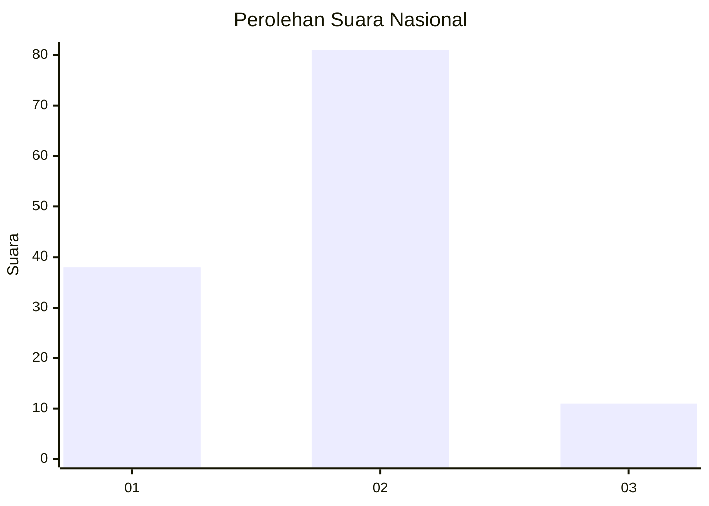
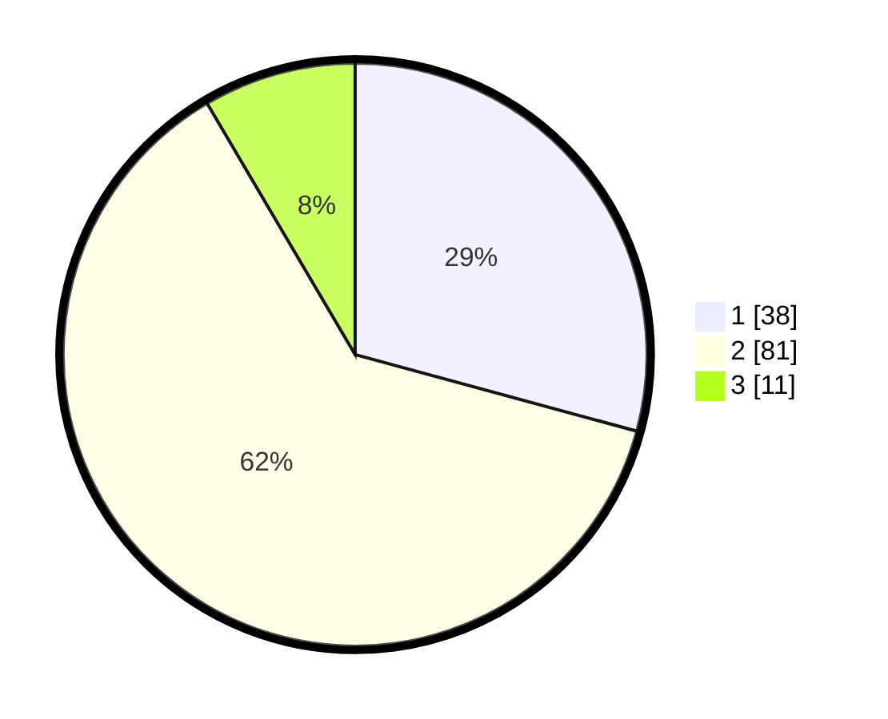

# Hasil

## Grafik

## Tabel

| No. | Nama Paslon    | Suara | Suara (raw) | Persentase |
|:--- |:-------------- | -----:| -----------:| ----------:|
| 1   | ANIES MUHAIMIN | 38    | [38][p-1]   | 29,23      |
| 2   | PRABOWO GIBRAN | 81    | [81][p-2]   | 62,31      |
| 3   | GANJAR MAHFUD  | 11    | [11][p-3]   | 8,46       |

[p-1]: https://github.com/gigit-pemilu/pemilu-2024/blob/main/pilpres/hitung-suara/sub/16-sumatera-selatan/sub/74-kota-prabumulih/sub/05-prabumulih-utara/sub/1004-mangga-besar/sub/025-tps/sub/paslon-1.txt
[p-2]: https://github.com/gigit-pemilu/pemilu-2024/blob/main/pilpres/hitung-suara/sub/16-sumatera-selatan/sub/74-kota-prabumulih/sub/05-prabumulih-utara/sub/1004-mangga-besar/sub/025-tps/sub/paslon-2.txt
[p-3]: https://github.com/gigit-pemilu/pemilu-2024/blob/main/pilpres/hitung-suara/sub/16-sumatera-selatan/sub/74-kota-prabumulih/sub/05-prabumulih-utara/sub/1004-mangga-besar/sub/025-tps/sub/paslon-3.txt

## Foto C Plano

https://sirekap-obj-formc.kpu.go.id/c016/pemilu/ppwp/16/74/05/10/04/1674051004025-20240214-215920--30625b6d-c7b4-4dca-b4e7-567ece3daa88.jpg

https://sirekap-obj-formc.kpu.go.id/c016/pemilu/ppwp/16/74/05/10/04/1674051004025-20240214-220134--889d1b44-06b6-4534-8de5-ddfbc07c03fd.jpg

https://sirekap-obj-formc.kpu.go.id/c016/pemilu/ppwp/16/74/05/10/04/1674051004025-20240214-220555--d03de771-7754-49a2-b32d-9ede57fafb8f.jpg

## Metadata

| Key        | Value               |
| ---------- | ------------------- |
| Time Stamp | 2024-02-16 00:00:26 |

