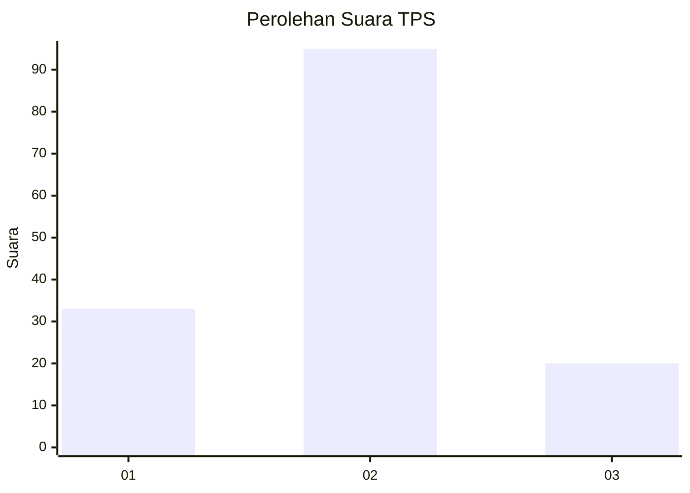
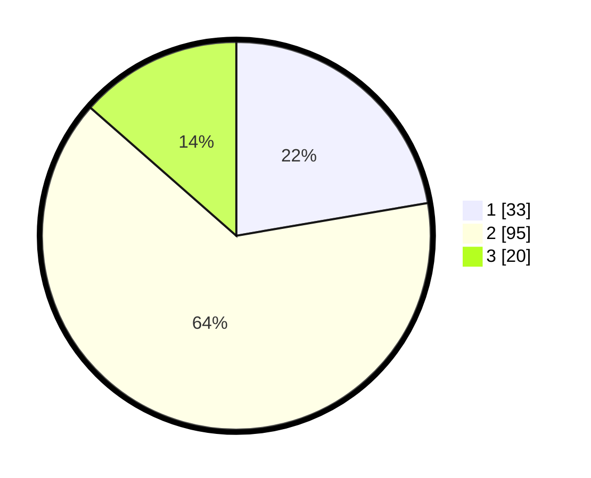

# Hasil

## Grafik

## Tabel

| No. | Nama Paslon    | Suara | Suara (raw) | Persentase |
|:--- |:-------------- | -----:| -----------:| ----------:|
| 1   | ANIES MUHAIMIN | 33    | [33][p-1]   | 22,30      |
| 2   | PRABOWO GIBRAN | 95    | [95][p-2]   | 64,19      |
| 3   | GANJAR MAHFUD  | 20    | [20][p-3]   | 13,51      |

[p-1]: https://github.com/gigit-pemilu/pemilu-2024-16-sumatera-selatan/blob/main/pilpres/hitung-suara/sub/16-sumatera-selatan/sub/74-kota-prabumulih/sub/05-prabumulih-utara/sub/1004-mangga-besar/sub/032-tps/sub/paslon-1.txt
[p-2]: https://github.com/gigit-pemilu/pemilu-2024-16-sumatera-selatan/blob/main/pilpres/hitung-suara/sub/16-sumatera-selatan/sub/74-kota-prabumulih/sub/05-prabumulih-utara/sub/1004-mangga-besar/sub/032-tps/sub/paslon-2.txt
[p-3]: https://github.com/gigit-pemilu/pemilu-2024-16-sumatera-selatan/blob/main/pilpres/hitung-suara/sub/16-sumatera-selatan/sub/74-kota-prabumulih/sub/05-prabumulih-utara/sub/1004-mangga-besar/sub/032-tps/sub/paslon-3.txt

## Foto C Plano

https://sirekap-obj-formc.kpu.go.id/3e38/pemilu/ppwp/16/74/05/10/04/1674051004032-20240214-155515--7aafda34-ad91-473f-8865-61ef0e157fe1.jpg

https://sirekap-obj-formc.kpu.go.id/3e38/pemilu/ppwp/16/74/05/10/04/1674051004032-20240214-155527--e3fdd8c0-9a3d-4e0f-8ce9-3b20a2e87551.jpg

https://sirekap-obj-formc.kpu.go.id/3e38/pemilu/ppwp/16/74/05/10/04/1674051004032-20240214-155535--73562d5c-d4e5-423d-8ef7-971dd76d21ef.jpg

## Metadata

| Key        | Value               |
| ---------- | ------------------- |
| Time Stamp | 2024-02-15 00:41:44 |

