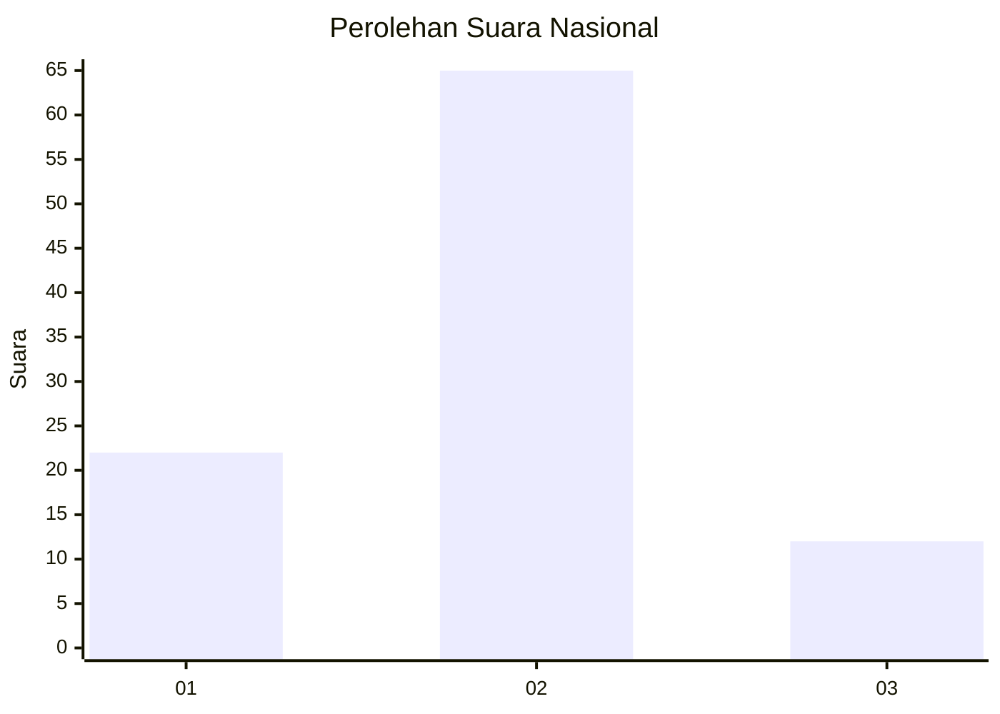
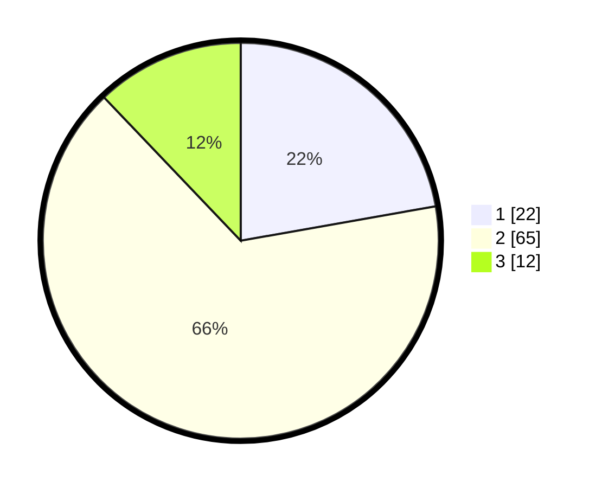

# Hasil

## Grafik

## Tabel

| No. | Nama Paslon    | Suara | Suara (raw) | Persentase |
|:--- |:-------------- | -----:| -----------:| ----------:|
| 1   | ANIES MUHAIMIN | 22    | [22][p-1]   | 22,22      |
| 2   | PRABOWO GIBRAN | 65    | [65][p-2]   | 65,66      |
| 3   | GANJAR MAHFUD  | 12    | [12][p-3]   | 12,12      |

[p-1]: https://github.com/gigit-pemilu/pemilu-2024/blob/main/pilpres/hitung-suara/sub/16-sumatera-selatan/sub/74-kota-prabumulih/sub/05-prabumulih-utara/sub/1004-mangga-besar/sub/033-tps/sub/paslon-1.txt
[p-2]: https://github.com/gigit-pemilu/pemilu-2024/blob/main/pilpres/hitung-suara/sub/16-sumatera-selatan/sub/74-kota-prabumulih/sub/05-prabumulih-utara/sub/1004-mangga-besar/sub/033-tps/sub/paslon-2.txt
[p-3]: https://github.com/gigit-pemilu/pemilu-2024/blob/main/pilpres/hitung-suara/sub/16-sumatera-selatan/sub/74-kota-prabumulih/sub/05-prabumulih-utara/sub/1004-mangga-besar/sub/033-tps/sub/paslon-3.txt

## Foto C Plano

https://sirekap-obj-formc.kpu.go.id/0097/pemilu/ppwp/16/74/05/10/04/1674051004033-20240214-210000--b159a2d5-8e63-49c8-b240-dfe375409430.jpg

https://sirekap-obj-formc.kpu.go.id/0097/pemilu/ppwp/16/74/05/10/04/1674051004033-20240214-210045--0a9e312c-efda-4839-b231-4c2ecbe53c45.jpg

https://sirekap-obj-formc.kpu.go.id/0097/pemilu/ppwp/16/74/05/10/04/1674051004033-20240214-210138--16506883-8b1b-49ea-a2e9-02efb9c8ff5c.jpg

## Metadata

| Key        | Value               |
| ---------- | ------------------- |
| Time Stamp | 2024-02-16 00:00:26 |

