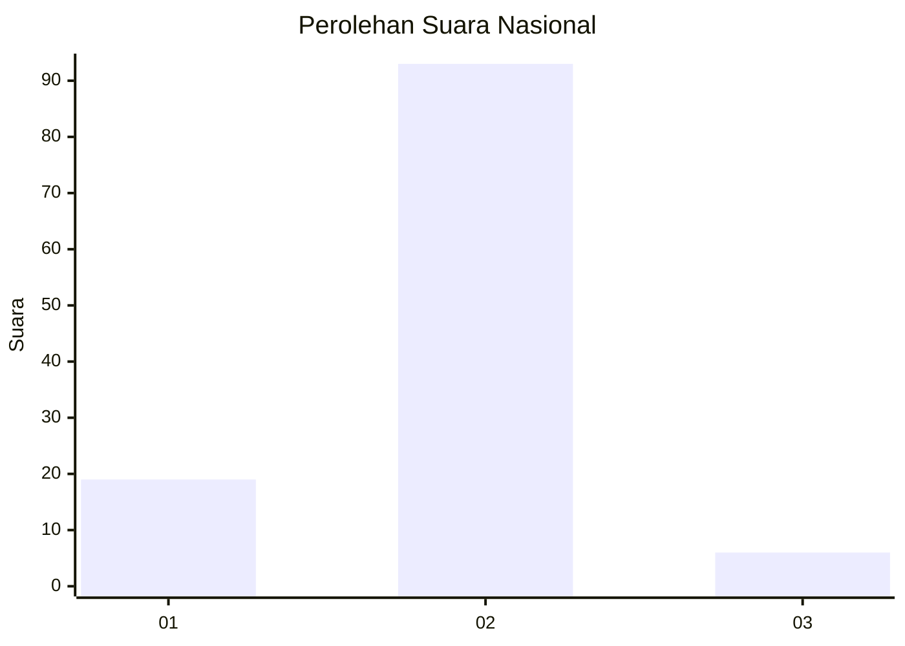
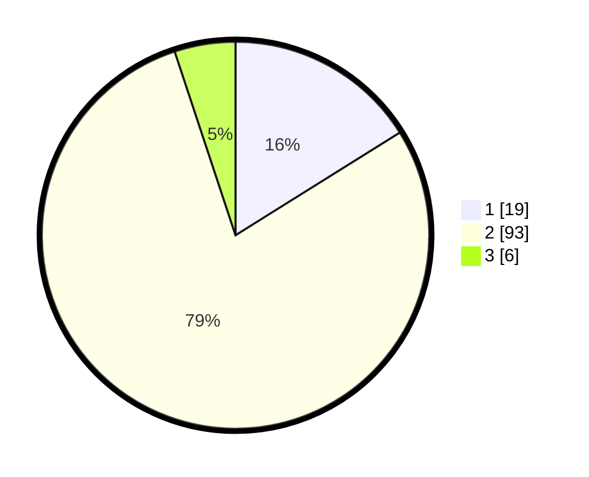

# Hasil

## Grafik

## Tabel

| No. | Nama Paslon    | Suara | Suara (raw) | Persentase |
|:--- |:-------------- | -----:| -----------:| ----------:|
| 1   | ANIES MUHAIMIN | 19    | [19][p-1]   | 16,10      |
| 2   | PRABOWO GIBRAN | 93    | [93][p-2]   | 78,81      |
| 3   | GANJAR MAHFUD  | 6     | [6][p-3]    | 5,08       |

[p-1]: https://github.com/gigit-pemilu/pemilu-2024/blob/main/pilpres/hitung-suara/sub/16-sumatera-selatan/sub/74-kota-prabumulih/sub/05-prabumulih-utara/sub/1004-mangga-besar/sub/035-tps/sub/paslon-1.txt
[p-2]: https://github.com/gigit-pemilu/pemilu-2024/blob/main/pilpres/hitung-suara/sub/16-sumatera-selatan/sub/74-kota-prabumulih/sub/05-prabumulih-utara/sub/1004-mangga-besar/sub/035-tps/sub/paslon-2.txt
[p-3]: https://github.com/gigit-pemilu/pemilu-2024/blob/main/pilpres/hitung-suara/sub/16-sumatera-selatan/sub/74-kota-prabumulih/sub/05-prabumulih-utara/sub/1004-mangga-besar/sub/035-tps/sub/paslon-3.txt

## Foto C Plano

https://sirekap-obj-formc.kpu.go.id/dfa2/pemilu/ppwp/16/74/05/10/04/1674051004035-20240214-224223--aac83023-3f2e-44a0-b840-4bbbc262c3f9.jpg

https://sirekap-obj-formc.kpu.go.id/dfa2/pemilu/ppwp/16/74/05/10/04/1674051004035-20240215-020126--e4d42045-49dd-4f84-8e07-37c309e465d8.jpg

https://sirekap-obj-formc.kpu.go.id/dfa2/pemilu/ppwp/16/74/05/10/04/1674051004035-20240214-190921--6e3d8094-0b3c-4704-80b9-0ff84a46e07a.jpg

## Metadata

| Key        | Value               |
| ---------- | ------------------- |
| Time Stamp | 2024-02-16 08:00:28 |

